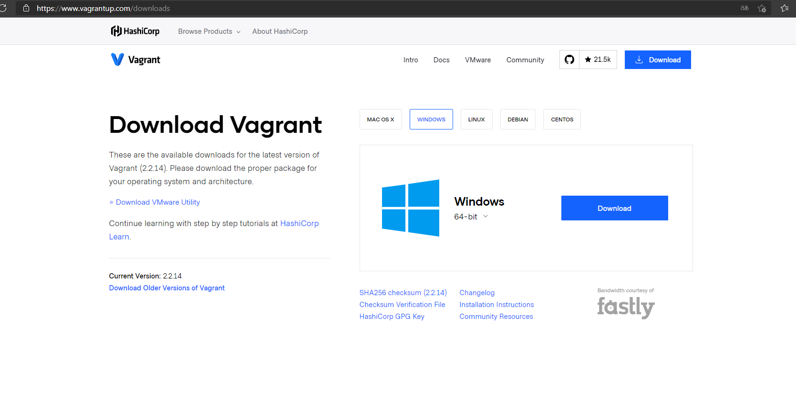
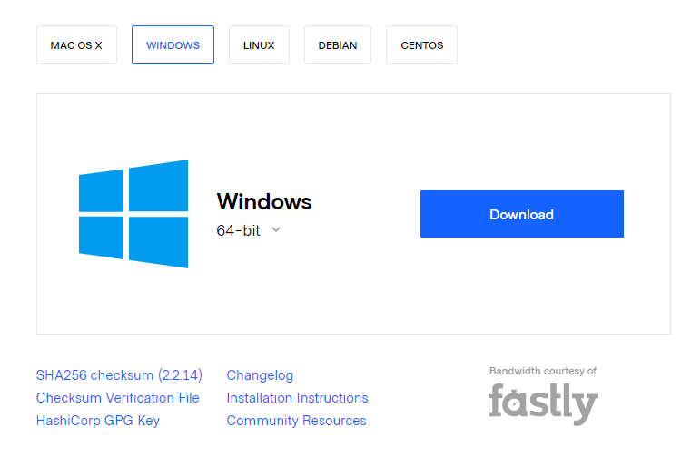
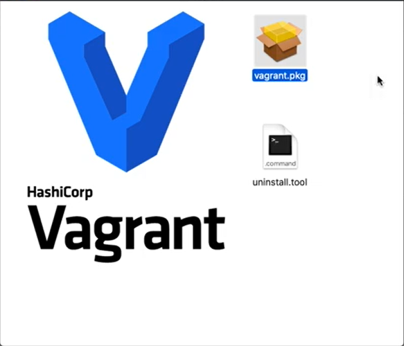
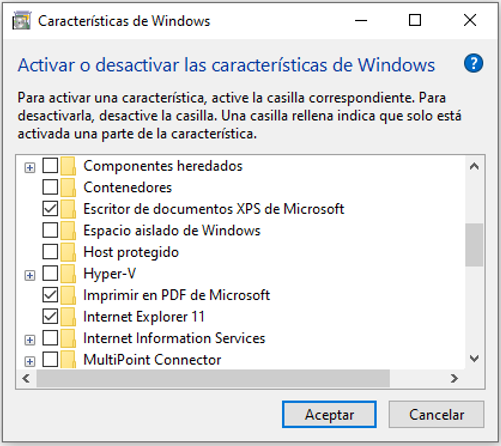
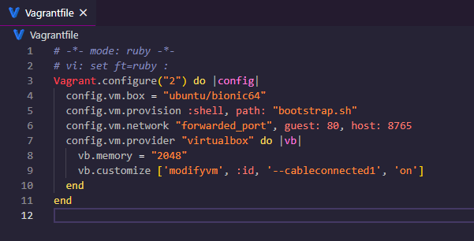
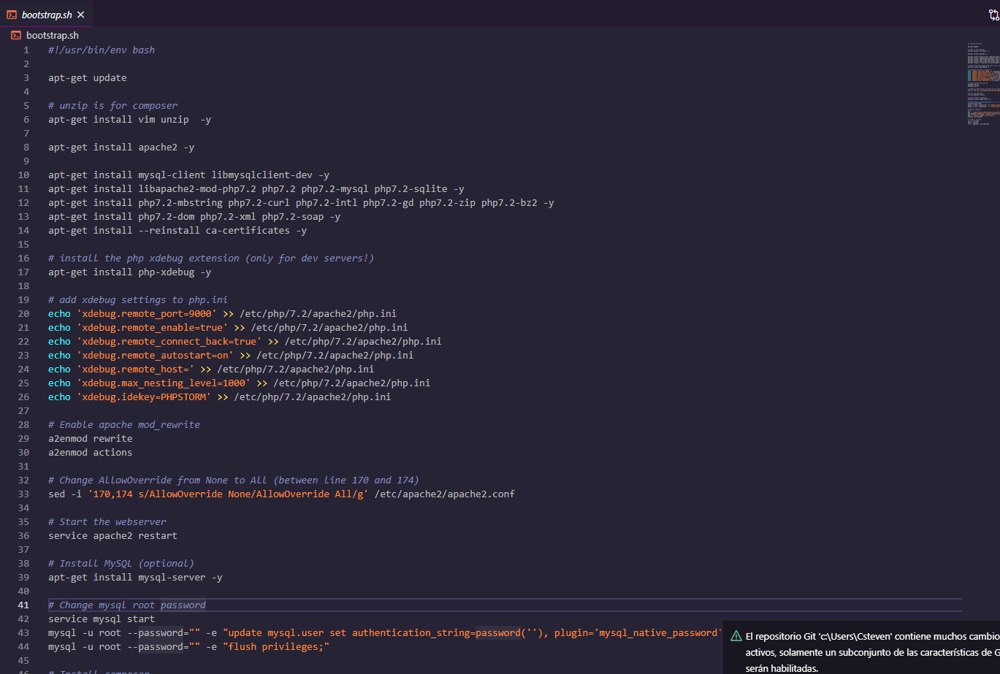
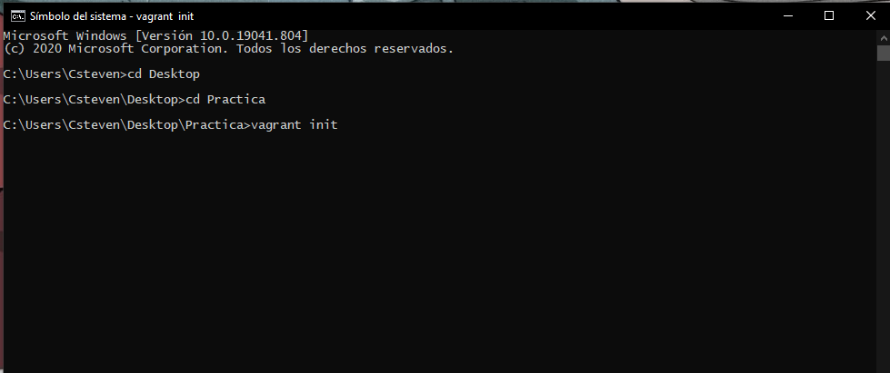
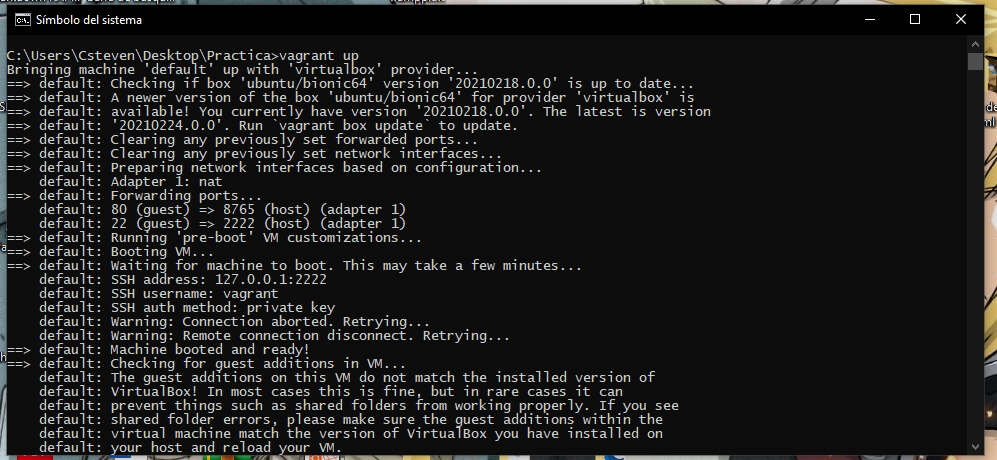
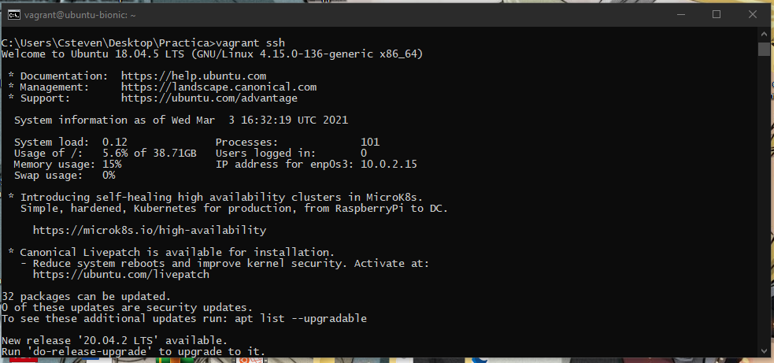

# **I. Instalando Vagrant**

Es necesario disponer de Vagrant para trabajar todos sobre el mismo entorno, para
eso descargue la herramienta visitando Download Vagrant. Seleccione el sistema
operativo con el que está trabajando. Ejecute el instalador, que no requiere ninguna
configuración adicional.

1. Muestre el resultado de la instalación, en un breve resumen de recomendación,
donde indica la configuración adecuada según su necesidad

~~~
Para poder crear un entorno de php en vagrant primero es necesario descargar el programa 
lo cual podremonos descargar al visitar al sitio wed
~~~

~~~
Seleccionamos la opcion para Windows y damos cic en descargar
~~~

~~~
Una vez ya descargado el archivo simplemente lo instalamos
~~~

# **II. Usando Vagrant**

Utilizar Vagrant es bastante sencillo. La pieza más importante es el fichero VagrantFile.
Este archivo contiene el nombre de la imagen base que queremos usar y el resto de la
configuración que queremos aplicar

1. Si usará Virtual Box debe deshabilitar Hyper-V de Windows

~~~
Para poder deshabilitar Hyper-v de windows existen dos procedimientos uno es con el siguiente codigo 
Disable-WindowsOptionalFeature -Online -FeatureName Microsoft-Hyper-V-All y tambien podemos ir a las
caracteristicas de windows y desmarcar la carpeta Hyper-V
~~~

2. El siguiente ejemplo es la configuración necesaria para obtener una máquina 

~~~
En mi caso esto es lo que contiene mi fichero Vagrantfile
~~~

3. Creamos el fichero provisioner.sh con el siguiente contenido, que hará que se instalen todos esos servicios

~~~
Tengo un fichero .sh pero lo nombre otra manera en mi caso es bootstrap.sh donde contiene todos los servicios que utilizare
~~~

4. El fichero anterior se ve un poco extenso, es su tarea analizar que realiza este fichero, recuerde que debe crearlo al lado del fichero Vagrantfile

~~~
El fichero .sh  contiene algunos comandos para instalar un servidor apache el cliente my sql, librerias de php para nuestro entorno
~~~

5. Inicie la máquina virtual, ejecutando el siguiente comando en el mismo directorio que tiene su Vagrantfile

~~~
Para empezar primero es inicializar nuestro vagrant con algun fichero por ejemplo el siguiente  para eso es necesario el comando:

vagrant init
~~~

~~~
luego de eso crearemos nuestra maquina con el comando :

vagrant up

realizara todo el aprovicionamiento ejecutando todos los comandos que le indique en el archivo bootstrap.sh al ejeutar el comando 
nos ira mostrando toda la informacion al respecto
~~~

6. Para acceder a la nueva máquina virtual, ejecute el siguiente comando en el mismo directorio que su Vagrantfile

~~~
luego ejecutamos el comando :

vagrant ssh

se nos abrira una terminal dentro de la maquina virtual creada
~~~

# **III. Contestasto algunas interroganges de los ejercicios**

b. Suponga el siguiente caso: Dispongo de un formulario HTML con un elemento
de entrada para nombres y un elemento de entrada de submit, que envía estos
datos a un fichero PHP usando el método POST. Ahora, sabemos que esto
funcionaría solo para manipular un nombre a la vez, pero nosotros necesitamos
que la información este ahí luego de regresar y enviar otro nombre. Analice este
caso y brinde una solución usando PHP.

~~~
Segun mi analisis necesitaremos utilizar una variable de secion en este caso  $_SESSION que nos ayudara a
contener la informacion,Esta es una 'superglobal' o una variable automatic global. Significa simplemente 
que es una variable que está disponible en cualquier parte del script.

session_start(); lo utilizamos para inicar la secion 

Tambien crear un array que nos permita alamcenar los nombres agregados

$nombres = array();

Luego de eso realizaremos validaciones para que cuando se ingrese un primer nombre nos permita almacenar mas 
nombres  y no perder los anterior mente guardados en array con la variable $_SESSION

if(isset($_POST['nombre']))
{
    if(isset($_SESSION['nombres'])){
         $nombres = $_SESSION['nombres'];
         $nombres[] = $_POST['nombre'];
         $_SESSION['nombres'] = $nombres;
     } else {
        /* array_push($_SESSION['nombres'], $_POST['nombre']);*/
        $nombres[] = $_POST['nombre'];
        $_SESSION['nombres'] = $nombres;
         var_dump( $_SESSION['nombres']);
     }
}

Y luego imprimimos el resultado

$valores = $_SESSION["nombres"];
foreach($valores as $val)
{
    echo $val." " ;
} 

~~~